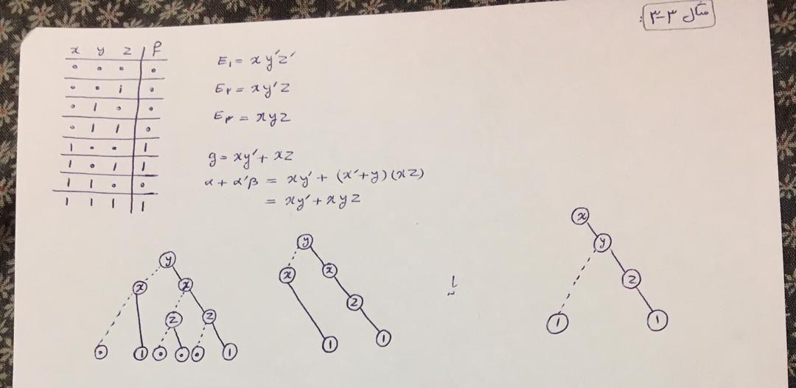
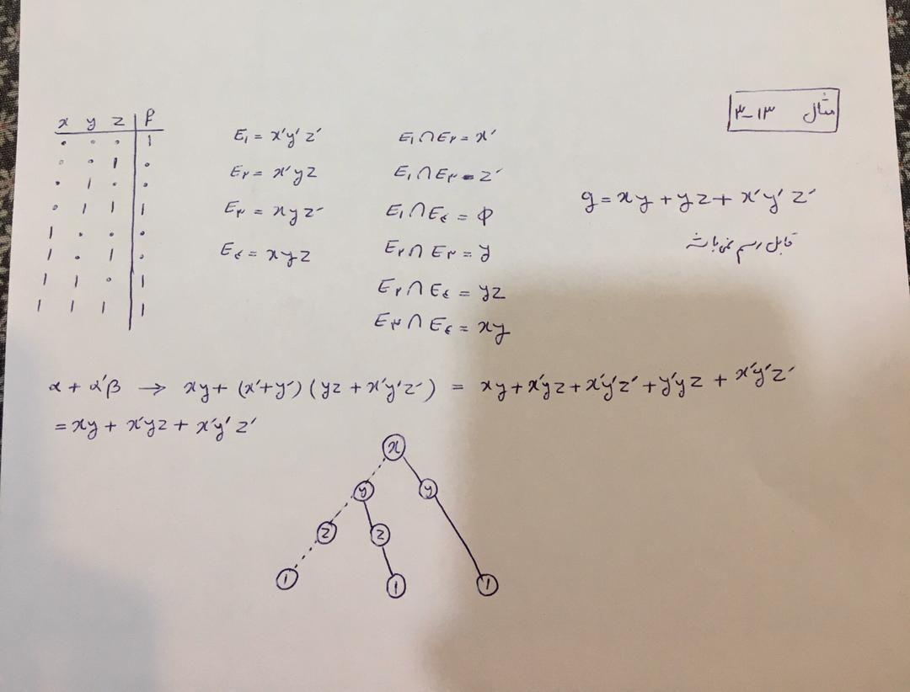

# Phd Math Project

A software to analyze a octal number and generate formula to produce graph. (Phd Project in mathematics field, Article)

I'm supervisor of this software to help in this research. (It will publish as article)

## Process

- Get octal number.
- Convert number to binary (base 2).
- Compare binary data to generate new matrix.
- Compare binary data to generate formula.
- Check formula to detect their edge is dotted or solid.

## Using

Run `python process.py`.

## Example

- Step1: [[0, 0, 1], [0, 1, 1], [0, 1, 0]]
- Step2: [[0, -1, 1], [0, -1, -1], [0, 1, -1]]
- Step3: [["x'", 'z'], ["x'", 'y']]
- Step4: [["x'", 'z', 0], ["x'", 'y', 0]]

0 means dotted, 1 means solid
